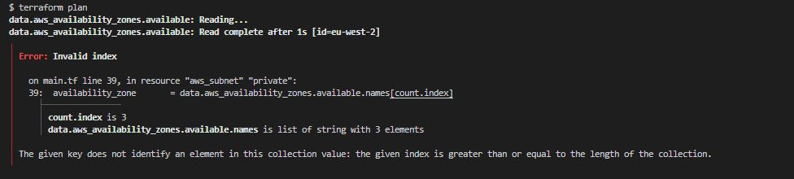
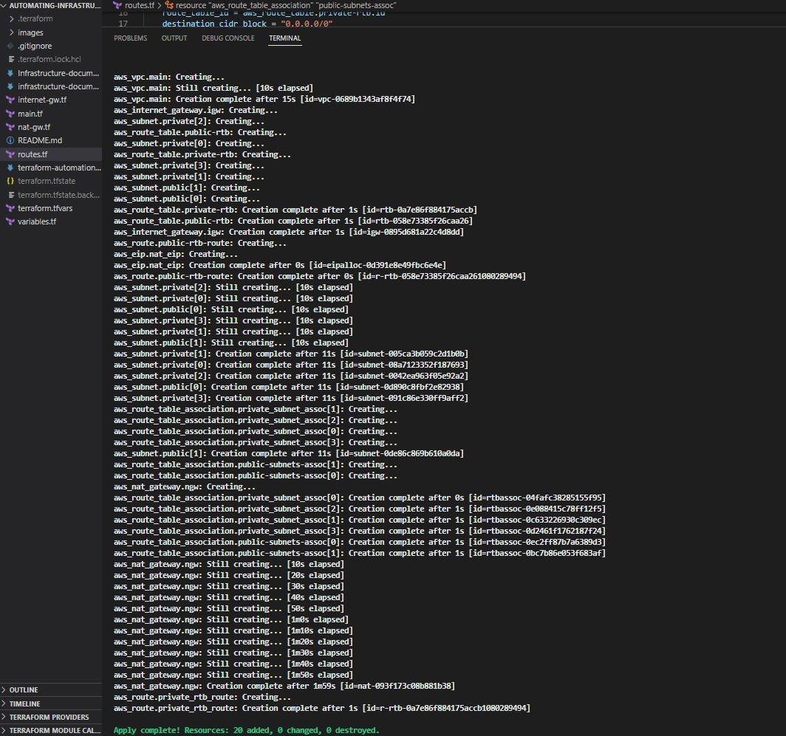
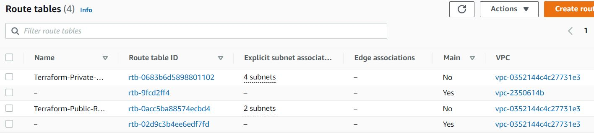
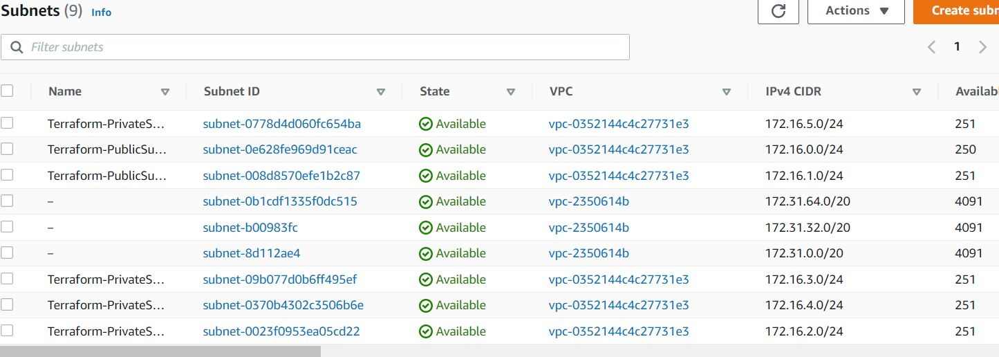
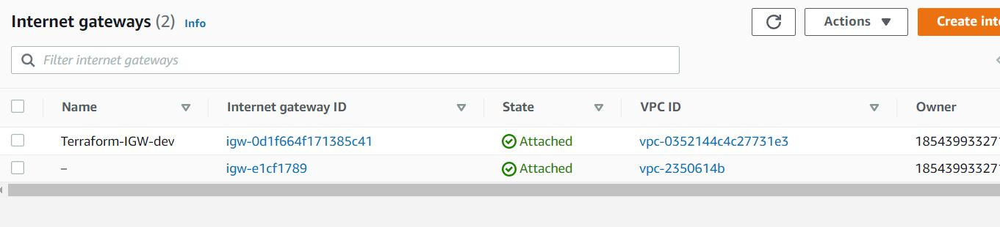
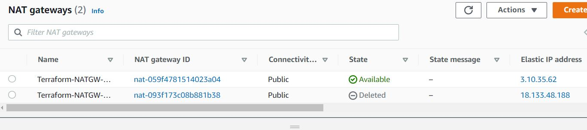
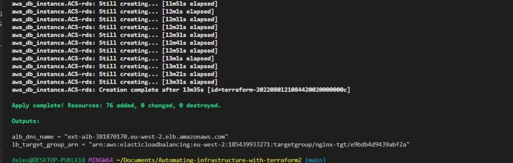

### Next was to create the 4 private subnets in our VPC
### Create private subnets
```
resource "aws_subnet" "private" {
  count                   = var.preferred_number_of_private_subnets == null ? length(data.aws_availability_zones.available.names) : var.preferred_number_of_private_subnets
  vpc_id                  = aws_vpc.main.id
  cidr_block              = cidrsubnet(var.vpc_cidr, 8, count.index)
  map_public_ip_on_launch = true
 availability_zone  = data.aws_availability_zones.available.names[count.index]
 }
```

I got an error running terraform plan pointing to the AZ index count for the private subnets.




-- This error got fixed by wrapping the AZ list in an element function

```
resource "aws_subnet" "private" {
  count                   = var.preferred_number_of_private_subnets == null ? length(data.aws_availability_zones.available.names) : var.preferred_number_of_private_subnets
  vpc_id                  = aws_vpc.main.id
  cidr_block              = cidrsubnet(var.vpc_cidr, 8, count.index)
  map_public_ip_on_launch = true
 availability_zone = element(data.aws_availability_zones.available.names[*], count.index)
 }
```

### Before continuing, let's implement tagging for all our resources

### Here, I will create the tag variable in variables.tf
```
variable "tags" {
  description = "A mapping of tags to assign to all resources."
  type        = map(string)
  default     = {}
}
```
### create the site wide default tags to be appended to the distinct tags later
```
tags = {
  Enviroment      = "production" 
  Owner-Email     = "dele@deleonabowu.io"
  Managed-By      = "Terraform"
  Billing-Account = "1234567890"
}
```

### To tag our resources we can merge the default tags with the resource name
```
tags = merge(
    var.tags,
    {
      Name = "Name of the resource"
    },
  )
  ```

 ### We shall use the format function to append the default tags to our resource name
  ```
  Name = format("%s-PrivateSubnet-%s",var.name,count.index)
  ```

  ### We also need to ensure that the ip addresses in private and public subnets do not overlap.This we do by adding 2 to count.index for the private subnet cidrsubnet()

  ```
  cidr_block = cidrsubnet(var.vpc_cidr, 8, count.index + 2)
  ```

  ```
  resource "aws_subnet" "private" {
  count                   = var.preferred_number_of_private_subnets == null ? length(data.aws_availability_zones.available.names) : var.preferred_number_of_private_subnets
  vpc_id                  = aws_vpc.main.id
  cidr_block              = cidrsubnet(var.vpc_cidr, 8, count.index + 2)
  map_public_ip_on_launch = true
 //availability_zone       = data.aws_availability_zones.available.names[count.index]
 availability_zone = element(data.aws_availability_zones.available.names[*], count.index)
 }
```


### The next resource to create will be the Internet Gateway

```
resource "aws_internet_gateway" "igw" {
  vpc_id = aws_vpc.main.id

  tags = merge(
    var.tags,
    {
      Name = format("%s-IGW-%s",var.name,var.environment)
    } 
  )
}
```

 ### Then the elastic IP for the NAT Gateway

```
resource "aws_eip" "nat_eip" {
  vpc = true

  depends_on = [aws_internet_gateway.igw]
 tags = merge(
    var.tags,
    {
      Name = format("%s-NATEIP-%s",var.name,var.environment)
    } 
  ) 

}
```

### Next is the NAT Gateway

```
resource "aws_nat_gateway" "ngw" {
  allocation_id = aws_eip.nat_eip.id
  subnet_id     = element(aws_subnet.public.*.id,0)
  depends_on = [aws_internet_gateway.igw]
 tags = merge(
    var.tags,
    {
      Name = format("%s-NATGW-%s",var.name,var.environment)
    } 
  )

  # To ensure proper ordering, it is recommended to add an explicit dependency
  # on the Internet Gateway for the VPC.
  
}
```

## Next, I created the route tables, route and subnet associations

### create private route table
```
resource "aws_route_table" "private-rtb" {
  vpc_id = aws_vpc.main.id

  tags = merge(
    var.tags,
    {
      Name = format("%s-Private-Route-Table", var.name)
    },
  )
}
```

### create route for the private route table and attach the nat gateway

```
resource "aws_route" "private_rtb_route" {
    route_table_id = aws_route_table.private-rtb.id
    destination_cidr_block = "0.0.0.0/0"
    gateway_id = aws_nat_gateway.ngw.id
  }
```

### associate all private subnets to the private route table

```
resource "aws_route_table_association" "private_subnet_assoc" {
    
    count = length(aws_subnet.private[*].id)
    subnet_id = element(aws_subnet.private[*].id, count.index)
    route_table_id = aws_route_table.private-rtb.id
  }

```

### create route table for the public subnets
```
resource "aws_route_table" "public-rtb" {
  vpc_id = aws_vpc.main.id

  tags = merge(
    var.tags,
    {
      Name = format("%s-Public-Route-Table", var.name)
    },
  )
}
```
### create route for the public route table and attach the internet gateway
```
resource "aws_route" "public-rtb-route" {
  route_table_id         = aws_route_table.public-rtb.id
  destination_cidr_block = "0.0.0.0/0"
  gateway_id             = aws_internet_gateway.igw.id
}
```
### associate all public subnets to the public route table
```
resource "aws_route_table_association" "public-subnets-assoc" {
  count          = length(aws_subnet.public[*].id)
  subnet_id      = element(aws_subnet.public[*].id, count.index)
  route_table_id = aws_route_table.public-rtb.id
}
```

### I ran terraform plan and terraform apply which provisioned the following resources to AWS in a multi-az set up:
```
– Our main vpc
– 2 Public subnets
– 4 Private subnets
– 1 Internet Gateway
– 1 NAT Gateway
– 1 Elastic IP for the NAT Gateway
– 2 Route tables for private and public subnets
```

### To clean up the code, we did some refactoring and moved some of the code into their own files

### I created the following files:
internet-gw.tf  - The internet gateway 
nat-gw.tf - The nat gateway
routes.tf   - The private and public route tables, routes and subnet associations

``` 
terraform plan
terraform apply
```

### Build was successful and 20 resources added



### route tables


### Subnets



### Internet Gateway



### Nat Gateway



#### Next, I will be creating the Application Load Balancer and the Auto scaling Groups, target groups and listeners
### I would need to create the certificate manager before the ALB
### I would need to create the Application Load balancer before the autoscalling groups

### Lets create the certificate (TLS/SSL)  
### I created a new file certificate.tf

```
touch certificate.tf
```
### I will need to create the certificate, a public zone and validate the certificate with the DNS method

### Create the certificate using a wildcard for all the domains created in workachoo.com

```
resource "aws_acm_certificate" "workachoo" {
  domain_name       = "*.workachoo.com"
  validation_method = "DNS"

  tags = {
    Environment = "dev"
  }

  lifecycle {
    create_before_destroy = true
  }
}

```
### Calling the hosted zone

```
resource "aws_route53_zone" "workachoo" {
  name = "workachoo.com"
  private_zone = false
}
```

### selecting validation method
```
resource "aws_route53_record" "workachoo" {
  for_each = {
    for dvo in aws_acm_certificate.workachoo.domain_validation_options : dvo.domain_name => {
      name   = dvo.resource_record_name
      record = dvo.resource_record_value
      type   = dvo.resource_record_type
    }
  }

  allow_overwrite = true
  name            = each.value.name
  records         = [each.value.record]
  ttl             = 60
  type            = each.value.type
  zone_id         = data.aws_route53_zone.workachoo.zone_id
}
```

### validate the certificate through DNS method
```
resource "aws_acm_certificate_validation" "workachoo" {
  certificate_arn         = aws_acm_certificate.workachoo.arn
  validation_record_fqdns = [for record in aws_route53_record.workachoo : record.fqdn]
}
```
### our A record names will be tooling.workachoo.com and wordpress.workachoo.com

### create records for tooling
```
resource "aws_route53_record" "tooling" {
  zone_id = data.aws_route53_zone.workachoo.zone_id
  name    = "tooling.workachoo.com"
  type    = "A"

  alias {
    name                   = aws_lb.ext-alb.dns_name
    zone_id                = aws_lb.ext-alb.zone_id
    evaluate_target_health = true
  }
}
```

### create records for wordpress
```
resource "aws_route53_record" "wordpress" {
  zone_id = data.aws_route53_zone.workachoo.zone_id
  name    = "wordpress.workachoo.com"
  type    = "A"

  alias {
    name                   = aws_lb.ext-alb.dns_name
    zone_id                = aws_lb.ext-alb.zone_id
    evaluate_target_health = true
  }
}
```

#########################

### Let's create the security groups in a file named sg.tf

##########################

```touch sg.tf
```
####

### Security group for external alb, to allow access from anywhere for HTTP and HTTPS traffic
```
resource "aws_security_group" "ext-alb-sg" {
  name        = "ext-alb-sg"
  vpc_id      = aws_vpc.main.id
  description = "Allow TLS inbound traffic"

  
  egress {
    from_port   = 0
    to_port     = 0
    protocol    = "-1"
    cidr_blocks = ["0.0.0.0/0"]
  }

 tags = merge(
    var.tags,
    {
      Name = "ext-alb-sg"
    },
  )

}


resource "aws_security_group_rule" "inbound-alb-http" {
  type                     = "ingress"
  from_port                = 80
  to_port                  = 80
  protocol                 = "tcp"
  cidr_blocks = ["0.0.0.0/0"]
  security_group_id        = aws_security_group.ext-alb-sg.id
}

resource "aws_security_group_rule" "inbound-alb-https" {
  type                     = "ingress"
  from_port                = 443
  to_port                  = 443
  protocol                 = "tcp"
  cidr_blocks = ["0.0.0.0/0"]
  security_group_id        = aws_security_group.ext-alb-sg.id
}


```
### Security group for bastion, to allow access into the bastion host from my device IP
```
resource "aws_security_group" "bastion_sg" {
  name        = "bastion_sg"
  vpc_id = aws_vpc.main.id
  description = "Allow incoming SSH connections."

  ingress {
    description = "SSH"
    from_port   = 22
    to_port     = 22
    protocol    = "tcp"
    cidr_blocks = ["0.0.0.0/0"]
  }

  egress {
    from_port   = 0
    to_port     = 0
    protocol    = "-1"
    cidr_blocks = ["0.0.0.0/0"]
  }

   tags = merge(
    var.tags,
    {
      Name = "Bastion-SG"
    },
  )
}
```

#### Security group for nginx reverse proxy, to allow access only from the external load balancer and bastion instance
```
resource "aws_security_group" "nginx-sg" {
  name   = "nginx-sg"
  vpc_id = aws_vpc.main.id

  egress {
    from_port   = 0
    to_port     = 0
    protocol    = "-1"
    cidr_blocks = ["0.0.0.0/0"]
  }

   tags = merge(
    var.tags,
    {
      Name = "nginx-SG"
    },
  )
}

resource "aws_security_group_rule" "inbound-nginx-http" {
  type                     = "ingress"
  from_port                = 443
  to_port                  = 443
  protocol                 = "tcp"
  source_security_group_id = aws_security_group.ext-alb-sg.id
  security_group_id        = aws_security_group.nginx-sg.id
}

resource "aws_security_group_rule" "inbound-bastion-ssh" {
  type                     = "ingress"
  from_port                = 22
  to_port                  = 22
  protocol                 = "tcp"
  source_security_group_id = aws_security_group.bastion_sg.id
  security_group_id        = aws_security_group.nginx-sg.id
}
```


### Security group for ialb, to have access only from nginx reverser proxy server
```
resource "aws_security_group" "int-alb-sg" {
  name   = "my-alb-sg"
  vpc_id = aws_vpc.main.id

  egress {
    from_port   = 0
    to_port     = 0
    protocol    = "-1"
    cidr_blocks = ["0.0.0.0/0"]
  }

  tags = merge(
    var.tags,
    {
      Name = "int-alb-sg"
    },
  )

}

resource "aws_security_group_rule" "inbound-ialb-https" {
  type                     = "ingress"
  from_port                = 443
  to_port                  = 443
  protocol                 = "tcp"
  source_security_group_id = aws_security_group.nginx-sg.id
  security_group_id        = aws_security_group.int-alb-sg.id
}
```
### Security group for webservers, to have access only from the internal load balancer and bastion instance

```
resource "aws_security_group" "webserver-sg" {
  name   = "webserver-sg"
  vpc_id = aws_vpc.main.id

  egress {
    from_port   = 0
    to_port     = 0
    protocol    = "-1"
    cidr_blocks = ["0.0.0.0/0"]
  }

  tags = merge(
    var.tags,
    {
      Name = "webserver-sg"
    },
  )

}

resource "aws_security_group_rule" "inbound-web-https" {
  type                     = "ingress"
  from_port                = 443
  to_port                  = 443
  protocol                 = "tcp"
  source_security_group_id = aws_security_group.int-alb-sg.id
  security_group_id        = aws_security_group.webserver-sg.id
}

resource "aws_security_group_rule" "inbound-web-ssh" {
  type                     = "ingress"
  from_port                = 22
  to_port                  = 22
  protocol                 = "tcp"
  source_security_group_id = aws_security_group.bastion_sg.id
  security_group_id        = aws_security_group.webserver-sg.id
}
```
### Security group for datalayer to alow traffic from websever on nfs and mysql port and bastion host on mysql port

```
resource "aws_security_group" "datalayer-sg" {
  name   = "datalayer-sg"
  vpc_id = aws_vpc.main.id

  egress {
    from_port   = 0
    to_port     = 0
    protocol    = "-1"
    cidr_blocks = ["0.0.0.0/0"]
  }

 tags = merge(
    var.tags,
    {
      Name = "datalayer-sg"
    },
  )
}

resource "aws_security_group_rule" "inbound-nfs-port" {
  type                     = "ingress"
  from_port                = 2049
  to_port                  = 2049
  protocol                 = "tcp"
  source_security_group_id = aws_security_group.webserver-sg.id
  security_group_id        = aws_security_group.datalayer-sg.id
}

resource "aws_security_group_rule" "inbound-mysql-bastion" {
  type                     = "ingress"
  from_port                = 3306
  to_port                  = 3306
  protocol                 = "tcp"
  source_security_group_id = aws_security_group.bastion_sg.id
  security_group_id        = aws_security_group.datalayer-sg.id
}

resource "aws_security_group_rule" "inbound-mysql-webserver" {
  type                     = "ingress"
  from_port                = 3306
  to_port                  = 3306
  protocol                 = "tcp"
  source_security_group_id = aws_security_group.webserver-sg.id
  security_group_id        = aws_security_group.datalayer-sg.id
}


```

## The next stage is to create the internet facing external application load balancer in a file called alb.tf
```
touch alb.tf
```


### We need to create an ALB to balance the traffic between the Instances:

```
resource "aws_lb" "ext-alb" {
  name     = "ext-alb"
  internal = false
  security_groups = [
    aws_security_group.ext-alb-sg.id,
  ]

  subnets = [
    aws_subnet.public[0].id,
    aws_subnet.public[1].id
  ]

   tags = merge(
    var.tags,
    {
      Name = "ACS-ext-alb"
    },
  )

  ip_address_type    = "ipv4"
  load_balancer_type = "application"
}
```
### We need to inform the ALB of where where route the traffic.  We need to create a Target Group for our load balancer
### Create the target group
### The targets are our nginx reverse proxy servers

```
resource "aws_lb_target_group" "nginx-tgt" {
  health_check {
    interval            = 10
    path                = "/healthstatus"
    protocol            = "HTTPS"
    timeout             = 5
    healthy_threshold   = 5
    unhealthy_threshold = 2
  }
  name        = "nginx-tgt"
  port        = 443
  protocol    = "HTTPS"
  target_type = "instance"
  vpc_id      = aws_vpc.main.id
}
```

### Next, we will create a Listener for the target group aws_lb_target_group.nginx-tgt

```
resource "aws_lb_listener" "nginx-listner" {
  load_balancer_arn = aws_lb.ext-alb.arn
  port              = 443
  protocol          = "HTTPS"
  certificate_arn   = aws_acm_certificate_validation.workachoo.certificate_arn

  default_action {
    type             = "forward"
    target_group_arn = aws_lb_target_group.nginx-tgt.arn
  }
}

```
### Next step is to create an Internal (Internal) Application Load Balancer (ALB)


### ----------------------------
### Internal Load Balancers for webservers
### ---------------------------------

```
resource "aws_lb" "ialb" {
  name     = "ialb"
  internal = true
  security_groups = [
    aws_security_group.int-alb-sg.id,
  ]

  subnets = [
    aws_subnet.private[0].id,
    aws_subnet.private[1].id
  ]

  tags = merge(
    var.tags,
    {
      Name = "ACS-int-alb"
    },
  )

  ip_address_type    = "ipv4"
  load_balancer_type = "application"
}
```
### To inform our ALB to where route the traffic we need to create a Target Group to point to its targets:

### --- Target group  for wordpress -------

```
resource "aws_lb_target_group" "wordpress-tgt" {
  health_check {
    interval            = 10
    path                = "/healthstatus"
    protocol            = "HTTPS"
    timeout             = 5
    healthy_threshold   = 5
    unhealthy_threshold = 2
  }

  name        = "wordpress-tgt"
  port        = 443
  protocol    = "HTTPS"
  target_type = "instance"
  vpc_id      = aws_vpc.main.id
}
```
### --- Target group for tooling -------

```
resource "aws_lb_target_group" "tooling-tgt" {
  health_check {
    interval            = 10
    path                = "/healthstatus"
    protocol            = "HTTPS"
    timeout             = 5
    healthy_threshold   = 5
    unhealthy_threshold = 2
  }

  name        = "tooling-tgt"
  port        = 443
  protocol    = "HTTPS"
  target_type = "instance"
  vpc_id      = aws_vpc.main.id
}
```
### Then we will need to create a Listener for this target Group

### For this aspect a single listener was created for the wordpress which is default,
### A rule was created to route traffic to tooling when the host header changes

```
resource "aws_lb_listener" "web-listener" {
  load_balancer_arn = aws_lb.ialb.arn
  port              = 443
  protocol          = "HTTPS"
  certificate_arn   = aws_acm_certificate_validation.workachoo.certificate_arn

  default_action {
    type             = "forward"
    target_group_arn = aws_lb_target_group.wordpress-tgt.arn
  }
}

```
### listener rule for tooling target

```
resource "aws_lb_listener_rule" "tooling-listener" {
  listener_arn = aws_lb_listener.web-listener.arn
  priority     = 99

  action {
    type             = "forward"
    target_group_arn = aws_lb_target_group.tooling-tgt.arn
  }

  condition {
    host_header {
      values = ["tooling.workachoo.com"]
    }
  }
}
```

### Next we need an IAM Role for our EC2 instances to give them access to some specific resources
### Let's create an AssumeRole with an AssumeRole policy. It grants EC2, permissions to assume the role.

### We will create the file roles.tf for this

```
touch roles.tf
```

```
resource "aws_iam_role" "ec2_instance_role" {
name = "ec2_instance_role"
  assume_role_policy = jsonencode({
    Version = "2012-10-17"
    Statement = [
      {
        Action = "sts:AssumeRole"
        Effect = "Allow"
        Sid    = ""
        Principal = {
          Service = "ec2.amazonaws.com"
        }
      },
    ]
  })

  tags = merge(
    var.tags,
    {
      Name = "aws assume role"
    },
  )
}
```

### Create IAM policy for this role
### This is where we need to define a required policy (i.e., permissions) according to our requirements. For example, allowing an IAM role to perform action describe applied to EC2 instances:

```
resource "aws_iam_policy" "policy" {
  name        = "ec2_instance_policy"
  description = "A test policy"
  policy = jsonencode({
    Version = "2012-10-17"
    Statement = [
      {
        Action = [
          "ec2:Describe*",
        ]
        Effect   = "Allow"
        Resource = "*"
      },
    ]

  })

  tags = merge(
    var.tags,
    {
      Name =  "aws assume policy"
    },
  )

}
```
### Attach the Policy to the IAM Role
### This is where, we will be attaching the policy which we created above, to the role we created in the first step.

```
resource "aws_iam_role_policy_attachment" "test-attach" {
        role       = aws_iam_role.ec2_instance_role.name
        policy_arn = aws_iam_policy.policy.arn
    }
```
### Create an Instance Profile and interpolate the IAM Role
```
    resource "aws_iam_instance_profile" "ip" {
        name = "aws_instance_profile_test"
        role =  aws_iam_role.ec2_instance_role.name
    }
```

### Next,I will create the Auto Scaling Groups (ASG) for nginx, bastion, wordpress and tooling

### This will be in asg-bastion-nginx.tf and asg-webserver.tf

```
touch asg-bastion-nginx.tf   asg-webserver.tf
```

### In asg-bastion-nginx.tf

#### Creating sns topic for all the auto scaling groups
```
resource "aws_sns_topic" "dele-sns" {
name = "Default_CloudWatch_Alarms_Topic"
}

resource "aws_autoscaling_notification" "dele_notifications" {
  group_names = [
    aws_autoscaling_group.bastion-asg.name,
    aws_autoscaling_group.nginx-asg.name,
    aws_autoscaling_group.wordpress-asg.name,
    aws_autoscaling_group.tooling-asg.name,
  ]
  notifications = [
    "autoscaling:EC2_INSTANCE_LAUNCH",
    "autoscaling:EC2_INSTANCE_TERMINATE",
    "autoscaling:EC2_INSTANCE_LAUNCH_ERROR",
    "autoscaling:EC2_INSTANCE_TERMINATE_ERROR",
  ]

  topic_arn = aws_sns_topic.dele-sns.arn
}
```

### Launch template for bastion
```
resource "random_shuffle" "az_list" {
  input        = data.aws_availability_zones.available.names
}

resource "aws_launch_template" "bastion-launch-template" {
  image_id               = var.ami
  instance_type          = "t2.micro"
  vpc_security_group_ids = [aws_security_group.bastion_sg.id]

  iam_instance_profile {
    name = aws_iam_instance_profile.ip.id
  }

  key_name = var.keypair

  placement {
    availability_zone = "random_shuffle.az_list.result"
  }

  lifecycle {
    create_before_destroy = true
  }

  tag_specifications {
    resource_type = "instance"

   tags = merge(
    var.tags,
    {
      Name = "bastion-launch-template"
    },
  )
  }

  user_data = filebase64("${path.module}/bastion.sh")
}
```

### ---- Autoscaling for bastion  hosts
```
resource "aws_autoscaling_group" "bastion-asg" {
  name                      = "bastion-asg"
  max_size                  = 2
  min_size                  = 2
  health_check_grace_period = 300
  health_check_type         = "ELB"
  desired_capacity          = 2

  vpc_zone_identifier = [
    aws_subnet.public[0].id,
    aws_subnet.public[1].id
  ]

  launch_template {
    id      = aws_launch_template.bastion-launch-template.id
    version = "$Latest"
  }
  tag {
    key                 = "Name"
    value               = "bastion-launch-template"
    propagate_at_launch = true
  }

}
```
### Launch template for nginx

resource "aws_launch_template" "nginx-launch-template" {
  image_id               = var.ami
  instance_type          = "t2.micro"
  vpc_security_group_ids = [aws_security_group.nginx-sg.id]

  iam_instance_profile {
    name = aws_iam_instance_profile.ip.id
  }

  key_name =  var.keypair

  placement {
    availability_zone = "random_shuffle.az_list.result"
  }

  lifecycle {
    create_before_destroy = true
  }

  tag_specifications {
    resource_type = "instance"

    tags = merge(
    var.tags,
    {
      Name = "nginx-launch-template"
    },
  )
  }

  user_data = filebase64("${path.module}/nginx.sh")
}

### ------ Autoscslaling group for reverse proxy nginx ---------

resource "aws_autoscaling_group" "nginx-asg" {
  name                      = "nginx-asg"
  max_size                  = 2
  min_size                  = 2
  health_check_grace_period = 300
  health_check_type         = "ELB"
  desired_capacity          = 2

  vpc_zone_identifier = [
    aws_subnet.public[0].id,
    aws_subnet.public[1].id
  ]

  launch_template {
    id      = aws_launch_template.nginx-launch-template.id
    version = "$Latest"
  }

  tag {
    key                 = "Name"
    value               = "nginx-launch-template"
    propagate_at_launch = true
  }

}

### attaching autoscaling group of nginx to external load balancer
resource "aws_autoscaling_attachment" "asg_attachment_nginx" {
  autoscaling_group_name = aws_autoscaling_group.nginx-asg.id
  lb_target_group_arn   = aws_lb_target_group.nginx-tgt.arn

  ### alb_target_group_arn changed to lb_target_group_arn as deprecated.


  #### Next is to set up autoscaling for the websevers

  ### Inside asg-webserver.tf 


  ### Launch template for wordpress
```
resource "aws_launch_template" "wordpress-launch-template" {
  image_id               = var.ami
  instance_type          = "t2.micro"
  vpc_security_group_ids = [aws_security_group.webserver-sg.id]

  iam_instance_profile {
    name = aws_iam_instance_profile.ip.id
  }

  key_name = var.keypair

  placement {
    availability_zone = "random_shuffle.az_list.result"
  }

  lifecycle {
    create_before_destroy = true
  }

  tag_specifications {
    resource_type = "instance"

    tags = merge(
    var.tags,
    {
      Name = "wordpress-launch-template"
    },
  )

  }

  user_data = filebase64("${path.module}/wordpress.sh")
}
```

### ---- Autoscaling for wordpress application

```
resource "aws_autoscaling_group" "wordpress-asg" {
  name                      = "wordpress-asg"
  max_size                  = 2
  min_size                  = 2
  health_check_grace_period = 300
  health_check_type         = "ELB"
  desired_capacity          = 2
  vpc_zone_identifier = [

    aws_subnet.private[0].id,
    aws_subnet.private[1].id
  ]

  launch_template {
    id      = aws_launch_template.wordpress-launch-template.id
    version = "$Latest"
  }
  tag {
    key                 = "Name"
    value               = "wordpress-asg"
    propagate_at_launch = true
  }
}
```
### Attaching autoscaling group of  wordpress application to internal loadbalancer
```
resource "aws_autoscaling_attachment" "asg_attachment_wordpress" {
  autoscaling_group_name = aws_autoscaling_group.wordpress-asg.id
  lb_target_group_arn   = aws_lb_target_group.wordpress-tgt.arn
}
```
### Launch template for toooling
```
resource "aws_launch_template" "tooling-launch-template" {
  image_id               = var.ami
  instance_type          = "t2.micro"
  vpc_security_group_ids = [aws_security_group.webserver-sg.id]

  iam_instance_profile {
    name = aws_iam_instance_profile.ip.id
  }

  key_name = var.keypair

  placement {
    availability_zone = "random_shuffle.az_list.result"
  }

  lifecycle {
    create_before_destroy = true
  }

  tag_specifications {
    resource_type = "instance"

  tags = merge(
    var.tags,
    {
      Name = "tooling-launch-template"
    },
  )

  }

  user_data = filebase64("${path.module}/tooling.sh")
}
```
### ---- Autoscaling for tooling -----
```
resource "aws_autoscaling_group" "tooling-asg" {
  name                      = "tooling-asg"
  max_size                  = 2
  min_size                  = 2
  health_check_grace_period = 300
  health_check_type         = "ELB"
  desired_capacity          = 2

  vpc_zone_identifier = [

    aws_subnet.private[0].id,
    aws_subnet.private[1].id
  ]

  launch_template {
    id      = aws_launch_template.tooling-launch-template.id
    version = "$Latest"
  }

  tag {
    key                 = "Name"
    value               = "tooling-launch-template"
    propagate_at_launch = true
  }
}
```
### attaching autoscaling group of  tooling application to internal loadbalancer
resource "aws_autoscaling_attachment" "asg_attachment_tooling" {
  autoscaling_group_name = aws_autoscaling_group.tooling-asg.id
  lb_target_group_arn   = aws_lb_target_group.tooling-tgt.arn
}
###  alb_target_group_arn now known as  lb_target_group_arn and is deprecated.


### Now what is left is the datalayer which concists of the RDS Database, Elastic File system(EFS) and using KMS keys.

### The first thing is to create a KMS key for the EFS

### I will create a file efs.tf for the EFS code
```
touch efs.tf
```

### Create key from key management system
```
resource "aws_kms_key" "ACS-kms" {
  description = "KMS key "
  policy      = <<EOF
  {
  "Version": "2012-10-17",
  "Id": "kms-key-policy",
  "Statement": [
    {
      "Sid": "Enable IAM User Permissions",
      "Effect": "Allow",
      "Principal": { "AWS": "arn:aws:iam::${var.account_no}:user/terraform" },
      "Action": "kms:*",
      "Resource": "*"
    }
  ]
}
EOF
}
```

### Create key alias
```
resource "aws_kms_alias" "alias" {
  name          = "alias/kms"
  target_key_id = aws_kms_key.ACS-kms.key_id
}
```


### Let us create EFS and it mount targets- add the following code to efs.tf

### Create Elastic file system
```
resource "aws_efs_file_system" "ACS-efs" {
  encrypted  = true
  kms_key_id = aws_kms_key.ACS-kms.arn

  tags = merge(
    var.tags,
    {
      Name = "ACS-efs"
    },
  )
}
```

### set first mount target for the EFS 
```
resource "aws_efs_mount_target" "subnet-1" {
  file_system_id  = aws_efs_file_system.ACS-efs.id
  subnet_id       = aws_subnet.private[2].id
  security_groups = [aws_security_group.datalayer-sg.id]
}

# set second mount target for the EFS 
resource "aws_efs_mount_target" "subnet-2" {
  file_system_id  = aws_efs_file_system.ACS-efs.id
  subnet_id       = aws_subnet.private[3].id
  security_groups = [aws_security_group.datalayer-sg.id]
}

# create access point for wordpress
resource "aws_efs_access_point" "wordpress" {
  file_system_id = aws_efs_file_system.ACS-efs.id

  posix_user {
    gid = 0
    uid = 0
  }

  root_directory {
    path = "/wordpress"

    creation_info {
      owner_gid   = 0
      owner_uid   = 0
      permissions = 0755
    }

  }

}
```
### create access point for tooling
```
resource "aws_efs_access_point" "tooling" {
  file_system_id = aws_efs_file_system.ACS-efs.id
  posix_user {
    gid = 0
    uid = 0
  }

  root_directory {

    path = "/tooling"

    creation_info {
      owner_gid   = 0
      owner_uid   = 0
      permissions = 0755
    }

  }
}

```


### This section will create the subnet group for the RDS  instance using the private subnet
```
resource "aws_db_subnet_group" "ACS-rds" {
  name       = "acs-rds"
  subnet_ids = [aws_subnet.private[2].id, aws_subnet.private[3].id]

 tags = merge(
    var.tags,
    {
      Name = "ACS-rds"
    },
  )
}
```

### create the RDS instance with the subnets group
```
resource "aws_db_instance" "ACS-rds" {
  allocated_storage      = 20
  storage_type           = "gp2"
  engine                 = "mysql"
  engine_version         = "5.7"
  instance_class         = "db.t2.micro"
  db_name                   = "deledb"
  username               = var.db-username
  password               = var.db-password
  parameter_group_name   = "default.mysql5.7"
  db_subnet_group_name   = aws_db_subnet_group.ACS-rds.name
  skip_final_snapshot    = true
  vpc_security_group_ids = [aws_security_group.datalayer-sg.id]
  multi_az               = "true"
}

```

```
terraform plan
```
```
terraform apply
```



## 76 Resources added successfully
# End of Project