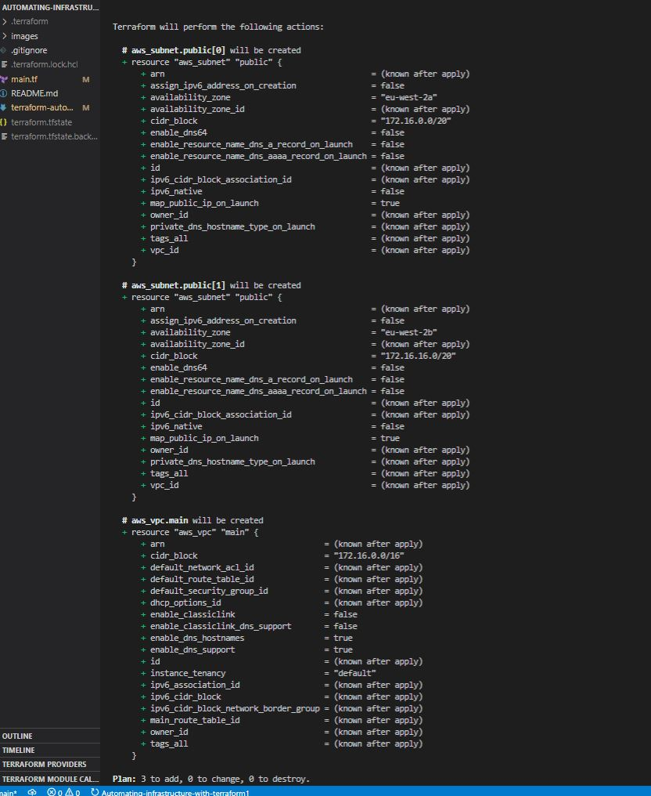
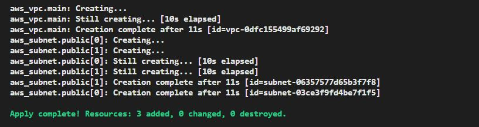
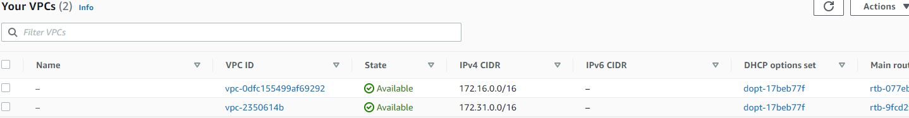
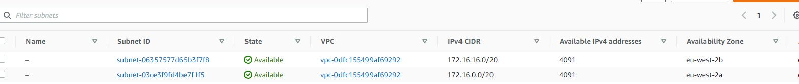

### AUTOMATE INFRASTRUCTURE WITH IAC USING TERRAFORM
---

### installed the following extentions for Terraform in VSCode
-- Terraform Configuration
--Hashicorp Syntax Highlighting

I created an S3 bucket in the AWS console called dele-dev-terraform-bucket to store the Terraform state file

I created an IAM user called Bandelero and gave the user AdministrativeAccess permissions. 

Next I created Access Keys for AWS CLI or programmatic access and also installed Python SDK (boto3)

I ran the following command to ensure that I could programatically access my AWS resources

```
import boto3
s3 = boto3.resource('s3')
for bucket in s3.buckets.all():
    print(bucket.name)

```
My S3 bucket dele-dev-terraform-bucket details successfully retrieved


### I created main.tf in the Terraform project folder


Get list of availability zones
```
        data "aws_availability_zones" "available" {
        state = "available"
        }
```
### The data can be retrieved with data.aws_availability_zones.available.names

### Store desired region in a variable
```
variable "region" {
        default = "eu-west-2"
    }

```


### Store desired VPC CIDR range in a variable
```
variable "vpc_cidr" {
        default = "172.16.0.0/16"
    }
```
### Store other VPC desired settings in variables

```
variable "enable_dns_support" {
        default = "true"
    }    


variable "enable_dns_hostnames" {
        default ="true" 
    }


variable "enable_classiclink" {
        default = "false"
    }

variable "enable_classiclink_dns_support" {
        default = "false"
    }

```

# Declare a variable to store the desired number of public subnets, and set the default value
```
variable "preferred_number_of_public_subnets" {
  default = 2
}
```

### Instruct terraform that the provider is AWS
```
provider "aws" {
  region = var.region    
   }

```
  

### Create VPC using variables set above

```
resource "aws_vpc" "main" {
  cidr_block                     = var.vpc_cidr
  enable_dns_support             = var.enable_dns_support
  enable_dns_hostnames           = var.enable_dns_hostnames
  enable_classiclink             = var.enable_classiclink
  enable_classiclink_dns_support = var.enable_classiclink_dns_support

  }
```

# Create public subnets

```
resource "aws_subnet" "public" {
  count = var.preferred_number_of_public_subnets == null ? length(data.aws_availability_zones.available.names) : var.preferred_number_of_public_subnets
  vpc_id                  = aws_vpc.main.id
  cidr_block              = cidrsubnet(var.vpc_cidr,4,count.index)
  map_public_ip_on_launch = true
  availability_zone       = data.aws_availability_zones.available.names[count.index]

  tags = {
    Name = "public-subnet"
  }

}

```
### The first part var.preferred_number_of_public_subnets == null checks if the value of the variable is set to null or has some value defined.
The second part ? and length(data.aws_availability_zones.available.names) means, if the first part is true, then use this. In other words, 
if preferred number of public subnets is null (Or not known) then set the value to the data returned by lenght function.
The third part : and var.preferred_number_of_public_subnets means, if the first condition is false, i.e preferred number of public subnets 
is not null then set the value to whatever is definied in var.preferred_number_of_public_subnets


### I ran terraform plan
```
terraform plan
```

  


To keep the code clean and efficient, I refactored the code by doing the following
I Create a new file and name variables.tf and copied all the variable declarations into it from main.tf.
I created another file named terraform.tfvars and set values for each of the variables.

### main.tf
---
```
# Get list of availability zones
data "aws_availability_zones" "available" {
state = "available"
}

provider "aws" {
  region = var.region
}

# Create VPC
resource "aws_vpc" "main" {
  cidr_block                     = var.vpc_cidr
  enable_dns_support             = var.enable_dns_support 
  enable_dns_hostnames           = var.enable_dns_support
  enable_classiclink             = var.enable_classiclink
  enable_classiclink_dns_support = var.enable_classiclink

}

# Create public subnets
resource "aws_subnet" "public" {
  count  = var.preferred_number_of_public_subnets == null ? length(data.aws_availability_zones.available.names) : var.preferred_number_of_public_subnets   
  vpc_id = aws_vpc.main.id
  cidr_block              = cidrsubnet(var.vpc_cidr, 4 , count.index)
  map_public_ip_on_launch = true
  availability_zone       = data.aws_availability_zones.available.names[count.index]
}

```

### variables.tf
---

```
# Get list of availability zones
        data "aws_availability_zones" "available" {
        state = "available"
        }

variable "region" {
        default = "eu-west-2"
    }


variable "vpc_cidr" {
        default = "172.16.0.0/16"
    }

variable "enable_dns_support" {
        default = "true"
    }    


variable "enable_dns_hostnames" {
        default ="true" 
    }


variable "enable_classiclink" {
        default = "false"
    }

variable "enable_classiclink_dns_support" {
        default = "false"
    }


# Declare a variable to store the desired number of public subnets, and set the default value
variable "preferred_number_of_public_subnets" {
  default = 2
}


```

### terraform.tfvars  Set the variables here. If not set, the defults are used.

```
region = "eu-west-2"

vpc_cidr = "172.16.0.0/16" 

enable_dns_support = "true" 

enable_dns_hostnames = "true"  

enable_classiclink = "false" 

enable_classiclink_dns_support = "false" 

preferred_number_of_public_subnets = 2

```

```
terraform plan
```
```
terraform apply
```



Infrastructure successfully created



VPC created successfully



### Subnets created successfully
---
## Phase 1 of Project (VPC, Subnets) Completed
---