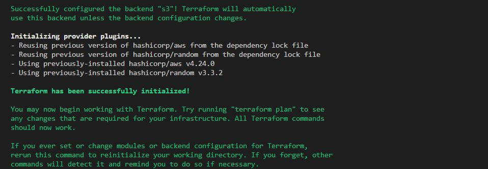

### The next step is to set up our infrastructure to use S3 as a backend for our state file.

### I enabled versioning so we can see the full revision history of our state files
```
  resource "aws_s3_bucket" "terraform_state" {
  bucket = "dele-dev-terraform-bucket-2"
  versioning {
    enabled = true
  }
  # Enable server-side encryption by default
  server_side_encryption_configuration {
    rule {
      apply_server_side_encryption_by_default {
        sse_algorithm = "AES256"
      }
    }
  }
}
```
### Next, I wcreated a DynamoDB table to handle locks and perform consistency checks. 
### I configured S3 as the backend to store state file and Dynamo DB to handle locking. 


```


resource "aws_dynamodb_table" "terraform_locks" {
  name         = "terraform-locks"
  billing_mode = "PAY_PER_REQUEST"
  hash_key     = "LockID"
  attribute {
    name = "LockID"
    type = "S"
  }
}
```


### So, let us run terraform apply to provision resources.

### Configure S3 Backend
```
terraform {
  backend "s3" {
    bucket         = "dele-dev-terraform-bucket-2"
    key            = "global/s3/terraform.tfstate"
    region         = "eu-west-2"
    dynamodb_table = "terraform-locks"
    encrypt        = true
  }
}
```


